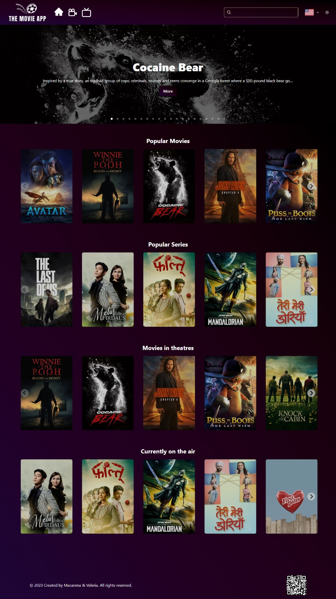

# The Movie App
# Nuestro buscador de películas y series💗
## Por Vale & Maca 😊

Para crear éste repositorio pusimos en práctica todo lo aprendido en el *módulo de React* del curso de *Frontend* de *Ada ITW* integrando también conocimientos adquiridos en los módulos de Javascript y HTML5.                

Para realizar éste proyecto utilizamos, *React*, *JavaScript*, y el framework *Chacra UI*. También incursionamos el el uso de otras librerías como React-Paginate, React-Responsive, React-responsive-carousel y SplideJs.
La información proviene de themoviedb.org que es una API gratuita y abierta, con datos relacionados al mundo del cine y la tlevisión.

🎞Nuestro proyecto cuenta con un input en el cual pueden buscarse películas y series poniendo el nombre de las mismas.  

🎞Está íntegramente traducido a 7 idiomas:inglés, español, portugués, ruso, chino, italiano y francés. Esto se logró por medio de un custom hook "useTranslate".  

🎞Tiene las péliculas y las series separadas en distintas categorías.  

🎞Contiene un qr que redirecciona al usuario a un "Contact Us"  

🎞Presenta un tema tema claro y un tema óscuro, para lograrlo usamos useContext.  

🎞Tiene carouseles con tarjetas, las cuales al hacer click te llevan al detalle de las péliculas o series y te permite ver el trailers y una sección con el elenco de las mismas

---
### Espero les guste nuestro trabajo💜💻

 

Finalmente [Acá está nuestro deployado](https://themovieapp-ada.netlify.app/)😍⌨️
